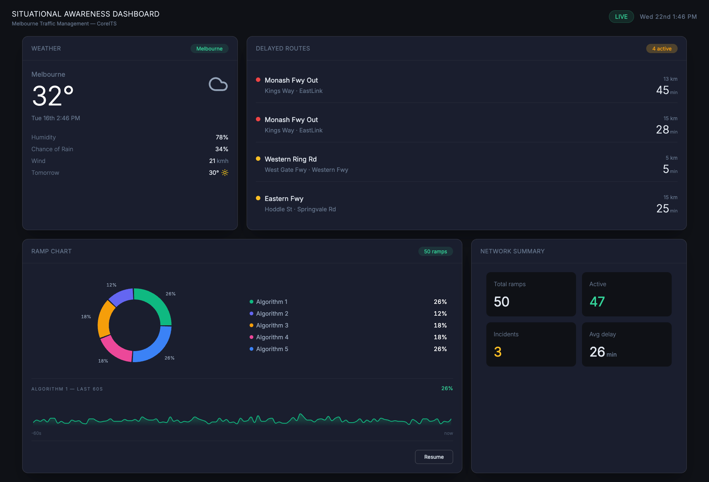

# Situational Awareness Dashboard

## 📸 Dashboard Overview

A high-performance monitoring dashboard built with React, TypeScript, and Vite. This application provides real-time visibility into transit network health, ramp metering algorithms, and localised weather conditions.



## 🚀 Quick Start

1. Install Dependencies:

```bash
npm install
```

2. Start development Server:

```bash
npm run dev
```

The app will be available at `http://localhost:3000`.

## 🏗️ Architecture & File Structure

This project follows a Feature-Based Architecture. Code is organised by domain rather than by technical type, improving discoverability and maintaining the Principle of Locality.

```
src/
├── api/                # API fetchers and global TypeScript interfaces
├── components/         # Shared, stateless UI components (Layout, Card, Badge, Header, etc.)
├── data/               # Strictly typed mock data sets
├── features/           # Self-contained business modules (The 4 Widgets)
│   └── [FeatureName]/  # Components, hooks, and tests for that specific widget
├── hooks/              # Global custom hooks
├── utils/              # Helper functions (date formatting, etc.)
└── index.ts            # Barrel file
```

## 🧩 Separation of Concerns

The architecture is built on a clear distinction between Logic Providers and Pure Presenters.

**Feature Widgets (Orchestrators)**: These are "Smart" components located in src/features/. They encapsulate the business logic for a specific domain. They are responsible for:

1. Triggering data fetching via Custom Hooks.

2. Managing internal UI state (e.g., Pause/Resume toggles).

3. Mapping raw API data into the shapes required by the UI.

**Shared Components (Presenters)**: Located in src/components/, these are "Dumb" or "Pure" components. They have zero knowledge of the API, business rules, or the global state. They receive data strictly via props and focus entirely on layout, styling, and accessibility.

## 🚫 Anti-Pattern Mitigation: Prop-Drilling

Prop-drilling is eliminated by strictly following the Principle of Locality:

**Colocated State**: State is kept at the lowest possible level. If a piece of data is only needed by a specific widget, it is managed inside that widget’s custom hook.

**Composition Over Threading**: Instead of "threading" data through multiple layers of components, we use React Composition. By passing sub-components (like a Badge or a specific Chart) into a Card slot, the intermediate components remain decoupled from the data requirements of their children.

**Hook-Based Sharing**: For the Ramp Algorithm data—which is consumed by both the chart and the distribution metrics—we utilize a shared custom hook. This allows both consumers to access the same logic and data stream without needing a global Context provider, keeping the data flow predictable and easy to debug.

## 🛠️ Technical Decisions

### State Architecture: Hooks & Composition over Context

This project intentionally avoids React Context or global state libraries in favor of Component-Local State and Custom Hooks to satisfy the requirement of avoiding prop-drilling without adding unnecessary overhead.

**Domain Isolation**: Each widget on the dashboard represents an isolated domain. By using hooks, we ensure that a state update in the WeatherWidget does not trigger a re-render in the RampAlgorithmsWidget. This maximizes performance and keeps the mental model simple: "One widget, one data source."

**Specialized Lifecycles**: Each widget utilizes a specialized hook (e.g., useRampAlgorithms) to manage its own internal lifecycle independently (Loading → Success/Error).

**Component Composition**: We keep the component tree flat by passing sub-components or status badges as props into the generic Card component. This prevents "prop-drilling" and allows the Card to remain a pure, representational wrapper.

---

### Performance & Memoization

**Transformation Memoization**: Complex data transformations, such as rampsToDistribution, are wrapped in useMemo. This ensures that we only re-calculate chart data when the raw API response actually changes.

**Stable References**: useCallback is used for event handlers passed to sub-components to prevent unnecessary re-renders of the UI.

---

### Styling & Responsive Strategy

The project utilises a utility-first CSS approach via **Tailwind CSS**. No separate `.css` files exist per component, ensuring that styles are colocated with the logic they describe.

**Engineering Trade-off**: Given the dashboard's scope, Tailwind was selected to prioritise rapid iteration and consistent spacing over the overhead of custom CSS modules. While the design captures the core aesthetic of the requirement, utility classes were used to prioritise functional accuracy over 1:1 pixel replication.

**Responsive Grid**: The dashboard employs a fluid CSS Grid system. It defaults to a two-column layout on desktop but intelligently collapses to a single-column vertical stack at the md breakpoint to maintain data density on mobile devices.

**Content Integrity**: A "No-Truncation" policy is applied to all critical data. On smaller screens, text is permitted to wrap rather than truncate. In an operational context (like traffic monitoring), hiding route names or status updates behind an ellipsis is an unacceptable risk.

---

### UI & Visualization Libraries

**Recharts**: Chosen for the Ramp Algorithm visualization due to its declarative nature and excellent support for responsive containers. It allows for a clean separation between the data array and the SVG rendering logic.

**Lucide-React**: Used for weather and status iconography. It provides a lightweight, tree-shakable icon set that ensures we only bundle the icons actually used in the dashboard.

---

### Data Integrity

Data for `src/mock` is moved to `src/data/` as typed TypeScript constants rather than raw JSON, using types imported from `src/api/types.ts`. This ensures the data is colocated with its type contract, and TypeScript can catch any drift between the data shape and the type definition at compile time.

## 🧪 Testing Strategy

The project uses Vitest and React Testing Library.

**Integration Testing**: We prioritize testing the "Widget" level. By mocking the custom hooks, we verify how the UI reacts to different API states.

**Unit Testing**: Utilities like formatDate and rampTransforms are covered by unit tests to ensure edge cases (like empty arrays or null dates) are handled gracefully.
